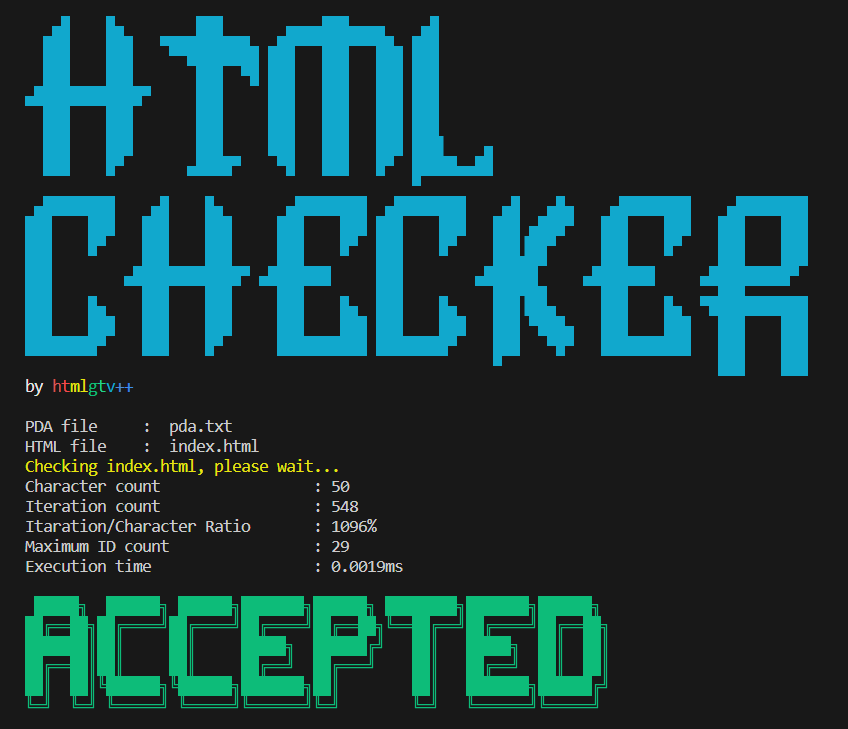
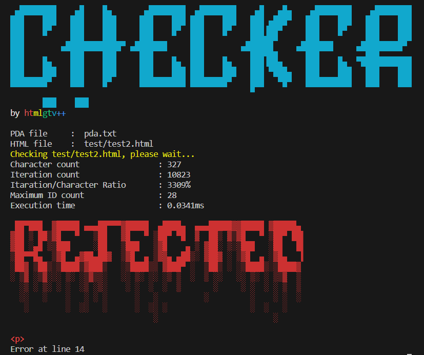

# Tugas Besar TBFO (IF2124)
## Kelompok 12: HTM(lgtv++)
| NIM      | NAME                           | 
| -------- | --------------------------     | 
| 13522074 | Muhammad Naufal Aulia          |  
| 13522086 | Muhammad Atpur Rafif           |
| 13522119 | Indraswara Galih Jayanegara    |


## Table of Contents
* [Tentang Program](#tentang-program)
* [Screenshots](#technologies-used)
* [Dependencies](#dependencies)
* [Screenshots](#screenshots)
* [Setup](#setup)


## HTML Checker <a href="tentang-program"></a>
Program <strong> HTML Checker <strong>
> HTML Checker merupakan program berbasis Command Line Interface yang dibuat dengan bahasa python untuk melakukan validasi kebenaran suatu sintaks dokumen HTML. Program ini memanfaatkan konsep Pushdown Automata (PDA) untuk dapat menangani struktur hierarkis yang umumnya ditemui dalam sintaksis HTML.


## Dependencies <a href="dependencies"></a>
- Python 3.x


## Screenshots <a href="screenshots"></a>




## Setup <a href="setup"></a>
1. Clone repository ini dengan 
    ```
    git clone https://github.com/NopalAul/Algeo02-22013
    ```
2. Di dalam direktori tersebut, buka terminal. Pastikan sudah tersedia file pda.txt dan file .html yang ingin dicek
3. Jalankan program dengan
    ```
    python main.py pda.txt "file.html"
    ```
    dan ganti "file.html" dengan file HTML yang ingin dicek


## Configuration Format
```
Q Z
(P I S) = R | T U
...
```
Konfigurasi file dimulai dari start state (`Q`) dan start stack (`Z`). Kemudian untuk seluruh stack dan input karakter tidak perlu dituliskan secara eksplisit. Pada baris kedua dan seterusnya, berisi dengan transiton function dengan format seperti pada baris kedua contoh di atas. Apabila sebuah baris diawali dengan `#` atau tidak sesuai dengan format baris kedua di atas, maka baris tersebut akan diabaikan. `P` adalah state input, `I` adalah input karakter, `S` adalah top stack. Sedangkan pada sisi sebelah kanan `R` adalah nested dan `T U` adalah state selanjutnya yang dipisahkan oleh spasi. Berikut merupakan karakter khusus yang dapat digunakan pada `I`:
1. `\newline`
2. `\space`
3. `\eps` (epsilon)